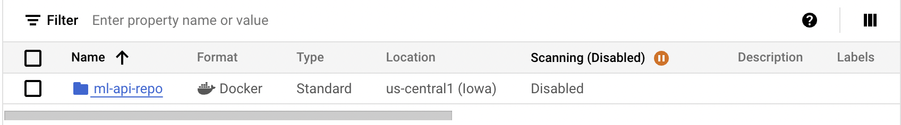

# Exam template for 02476 Machine Learning Operations

This is the report template for the exam. Please only remove the text formatted as with three dashes in front and behind
like:


Where you instead should add your answers. Any other changes may have unwanted consequences when your report is
auto-generated at the end of the course. For questions where you are asked to include images, start by adding the image
to the `figures` subfolder (please only use `.png`, `.jpg` or `.jpeg`) and then add the following code in your answer:

```markdown

```

In addition to this markdown file, we also provide the `report.py` script that provides two utility functions:

Running:

```bash
python report.py html
```

Will generate a `.html` page of your report. After the deadline for answering this template, we will auto-scrape
everything in this `reports` folder and then use this utility to generate a `.html` page that will be your serve
as your final hand-in.

Running

```bash
python report.py check
```

Will check your answers in this template against the constraints listed for each question e.g. is your answer too
short, too long, or have you included an image when asked. For both functions to work you mustn't rename anything.
The script has two dependencies that can be installed with

```bash
pip install typer markdown
```

## Overall project checklist

The checklist is *exhaustive* which means that it includes everything that you could do on the project included in the
curriculum in this course. Therefore, we do not expect at all that you have checked all boxes at the end of the project.
The parenthesis at the end indicates what module the bullet point is related to. Please be honest in your answers, we
will check the repositories and the code to verify your answers.

### Week 1

* [x] Create a git repository (M5)
* [x] Make sure that all team members have write access to the GitHub repository (M5)
* [x] Create a dedicated environment for you project to keep track of your packages (M2)
* [x] Create the initial file structure using cookiecutter with an appropriate template (M6)
* [x] Fill out the `data.py` file such that it downloads whatever data you need and preprocesses it (if necessary) (M6)
* [x] Add a model to `model.py` and a training procedure to `train.py` and get that running (M6)
* [x] Remember to fill out the `requirements.txt` and `requirements_dev.txt` file with whatever dependencies that you
    are using (M2+M6)
* [x] Remember to comply with good coding practices (`pep8`) while doing the project (M7)
* [x] Do a bit of code typing and remember to document essential parts of your code (M7)
* [x] Setup version control for your data or part of your data (M8)
* [x] Add command line interfaces and project commands to your code where it makes sense (M9)
* [x] Construct one or multiple docker files for your code (M10)
* [x] Build the docker files locally and make sure they work as intended (M10)
* [x] Write one or multiple configurations files for your experiments (M11)
* [x] Used Hydra to load the configurations and manage your hyperparameters (M11)
* [x] Use profiling to optimize your code (M12)
* [x] Use logging to log important events in your code (M14)
* [x] Use Weights & Biases to log training progress and other important metrics/artifacts in your code (M14)
* [ ] Consider running a hyperparameter optimization sweep (M14)
* [x] Use PyTorch-lightning (if applicable) to reduce the amount of boilerplate in your code (M15)

### Week 2

* [x] Write unit tests related to the data part of your code (M16)
* [x] Write unit tests related to model construction and or model training (M16)
* [x] Calculate the code coverage (M16)
* [x] Get some continuous integration running on the GitHub repository (M17)
* [x] Add caching and multi-os/python/pytorch testing to your continuous integration (M17)
* [x] Add a linting step to your continuous integration (M17)
* [X] Add pre-commit hooks to your version control setup (M18)
* [ ] Add a continues workflow that triggers when data changes (M19)
* [ ] Add a continues workflow that triggers when changes to the model registry is made (M19)
* [x] Create a data storage in GCP Bucket for your data and link this with your data version control setup (M21)
* [ ] Create a trigger workflow for automatically building your docker images (M21)
* [ ] Get your model training in GCP using either the Engine or Vertex AI (M21)
* [x] Create a FastAPI application that can do inference using your model (M22)
* [x] Deploy your model in GCP using either Functions or Run as the backend (M23)
* [x] Write API tests for your application and setup continues integration for these (M24)
* [ ] Load test your application (M24)
* [ ] Create a more specialized ML-deployment API using either ONNX or BentoML, or both (M25)
* [ ] Create a frontend for your API (M26)

### Week 3

* [ ] Check how robust your model is towards data drifting (M27)
* [ ] Deploy to the cloud a drift detection API (M27)
* [ ] Instrument your API with a couple of system metrics (M28)
* [ ] Setup cloud monitoring of your instrumented application (M28)
* [ ] Create one or more alert systems in GCP to alert you if your app is not behaving correctly (M28)
* [ ] If applicable, optimize the performance of your data loading using distributed data loading (M29)
* [ ] If applicable, optimize the performance of your training pipeline by using distributed training (M30)
* [ ] Play around with quantization, compilation and pruning for you trained models to increase inference speed (M31)

### Extra

* [ ] Write some documentation for your application (M32)
* [ ] Publish the documentation to GitHub Pages (M32)
* [x] Revisit your initial project description. Did the project turn out as you wanted?
* [x] Create an architectural diagram over your MLOps pipeline
* [x] Make sure all group members have an understanding about all parts of the project
* [x] Uploaded all your code to GitHub

## Group information

### Question 1
> **Enter the group number you signed up on <learn.inside.dtu.dk>**
>
> Answer:

57

### Question 2
> **Enter the study number for each member in the group**
>
> Example:
>
> *, sXXXXXX, sXXXXXX*
>
> Answer:
s233347, s194633, s233249, s232531


### Question 3
> **A requirement to the project is that you include a third-party package not covered in the course. What framework**
> **did you choose to work with and did it help you complete the project?**
>
> Recommended answer length: 100-200 words.
>
> Example:
> *We used the third-party framework ... in our project. We used functionality ... and functionality ... from the*
> *package to do ... and ... in our project*.
>
> Answer:

We used the Albumentations library in our project to perform data augmentation on images. By using functionalities such as RandomResizedCrop, HorizontalFlip, GaussNoise, GaussianBlur, and OpticalDistortion, we generated a wide variety of transformations to enhance model robustness. These operations helped us randomly crop images, flip them horizontally, introduce noise, and even distort them with grid-based or optical manipulations. Compared to PyTorch’s own torchvision data augmentation functions, Albumentation offers significant performance improvements which makes it an easy choice for us.

> Torch metrics was used to get the F1 score, which captures both precision and recall in a single measure, making it especially useful for imbalanced datasets.

## Coding environment

> In the following section we are interested in learning more about you local development environment. This includes
> how you managed dependencies, the structure of your code and how you managed code quality.

### Question 4

> **Explain how you managed dependencies in your project? Explain the process a new team member would have to go**
> **through to get an exact copy of your environment.**
>
> Recommended answer length: 100-200 words
>
> Example:
> *We used ... for managing our dependencies. The list of dependencies was auto-generated using ... . To get a*
> *complete copy of our development environment, one would have to run the following commands*
>
> Answer:

We used conda for managing our dependencies, with pip handling additional Python packages. Our `environment.yaml` defines a structured environment with:
- Core Python 3.11 installation
- Package sources from conda-forge and defaults channels
- Essential build tools (setuptools, pip)
- Additional dependencies managed through requirements files

To get a complete copy of our development environment, one would have to run the following commands:

```bash
# Create and activate conda environment from yaml specification
conda env create -f environment.yaml
conda activate ml_ops_project
```

This ensures all team members have identical development environments with the same package versions and development tools installed, with proper Python path configuration.


### Question 5

> **We expect that you initialized your project using the cookiecutter template. Explain the overall structure of your**
> **code. What did you fill out? Did you deviate from the template in some way?**
>
> Recommended answer length: 100-200 words
>
> Example:
> *From the cookiecutter template we have filled out the ... , ... and ... folder. We have removed the ... folder*
> *because we did not use any ... in our project. We have added an ... folder that contains ... for running our*
> *experiments.*
>
> Answer:

From the [MLOps template](https://github.com/SkafteNicki/mlops_template) we have filled the src, tests, configs, data, dockerfiles, reports and models folders. We did not see any need for notebooks, so we deleted that folder. Inside the src folder we split the data script into a `prepare_data.py` and a `data.py`script. Further we did not use the visualize script so we also deleted that one. The `evaluate.py` script was replaced with a `predict.py` script. This was done because our training script also evaluates the model (through the pytorch-lightning Trainer module). In the tests folder we filled in pytests for the model, data and api. We also use some dependency configuration folders like .dvc and .github.


### Question 6

> **Did you implement any rules for code quality and format? What about typing and documentation? Additionally,**
> **explain with your own words why these concepts matters in larger projects.**
>
> Recommended answer length: 100-200 words.
>
> Example:
> *We used ... for linting and ... for formatting. We also used ... for typing and ... for documentation. These*
> *concepts are important in larger projects because ... . For example, typing ...*
>
> Answer:

We used ruff for linting and formatting with specific rule selections (E, F, I) covering error detection, flake8 rules and import sorting. Our ruff configuration enforces line lengths of 120 characters (which is a bit more than the standard PEP 8 recommendation) and excludes common directories like .git, build, and dist. Throughout the project, we strived to maintain consistent use of Python type hints to improve code clarity and catch type-related errors early. For documentation, we made an effort to include descriptive docstrings for our functions and classes, particularly in core modules like prepare_data and predict.
These practices are vital in larger projects for several key reasons:

1. Consistent formatting makes code reviews more efficient and helps new team members adapt quickly

2. Type hints serve as live documentation of expected inputs and outputs, catching potential errors before runtime

3. Docstrings and clear documentation reduce onboarding time and make the codebase more maintainable

The importance of these tools became evident in our daily workflow - code reviews focused on logic rather than style issues, and type hints helped prevent type-related bugs during development.

## Version control

> In the following section we are interested in how version control was used in your project during development to
> corporate and increase the quality of your code.

### Question 7

> **How many tests did you implement and what are they testing in your code?**
>
> Recommended answer length: 50-100 words.
>
> Example:
> *In total we have implemented X tests. Primarily we are testing ... and ... as these the most critical parts of our*
> *application but also ... .*
>
> Answer:

In our continuous effort to ensure the reliability of our machine learning pipeline, we have expanded our testing suite. Currently, there are a total of 22 tests implemented across three primary test files:

1. Data Pipeline Testing (`test_data.py`):
   - Dataset initialization and validation
   - Data loading and transformations
   - DataModule functionality
   - Image transformations and preprocessing

2. Model Testing (`test_model.py`):
   - Model initialization
   - Forward pass functionality
   - Training and validation steps
   - Optimizer and scheduler configuration
   - Output shape verification

3. API Endpoint Testing (`test_api.py`):
   - Root endpoint accessibility
   - Predictions for image inputs
   - Error handling

### Question 8

> **What is the total code coverage (in percentage) of your code? If your code had a code coverage of 100% (or close**
> **to), would you still trust it to be error free? Explain you reasoning.**
>
> Recommended answer length: 100-200 words.
>
> Example:
> *The total code coverage of code is X%, which includes all our source code. We are far from 100% coverage of our **
> *code and even if we were then...*
>
> Answer:

Based on our coverage report, our total code coverage is 38%, which is relatively low. However, this is to be expected, as we did not implement test for all crucial parts of our codebase.

- Data handling has good coverage (85%): data.py
- Model implementation has moderate coverage (63%): model.py
- Three critical modules have 0% coverage: predict.py, prepare_data.py, and train.py

Even if we achieved 100% code coverage, we would not consider the code completely error-free.

1. Code coverage only measures which lines of code are executed during tests, not the quality or comprehensiveness of those tests

2. Edge cases and real-world scenarios might not be captured even with full line coverage

3. Integration issues between components might still exist even if individual units are fully tested

4. Certain types of errors like race conditions, memory leaks, or performance issues might not be detected by unit tests

5. Business logic errors could still exist even if the code executes without technical errors

### Question 9

> **Did you workflow include using branches and pull requests? If yes, explain how. If not, explain how branches and**
> **pull request can help improve version control.**
>
> Recommended answer length: 100-200 words.
>
> Example:
> *We made use of both branches and PRs in our project. In our group, each member had an branch that they worked on in*
> *addition to the main branch. To merge code we ...*
>
> Answer:

We tried to keep the state of our main branch in a way that our main functionalities can always be run as-is. Therefore, for larger features that required more than a few lines of code or the addition of new files, we created feature branches. We used pull requests to review and merge them just to get used to them, but most of us defaulted to just merging them ourselves when we reached a running state. This was generally no problem as most of our tasks were small, contained and independent. The only file that regularly led to merge conflicts was actually this README file.

### Question 10

> **Did you use DVC for managing data in your project? If yes, then how did it improve your project to have version**
> **control of your data. If no, explain a case where it would be beneficial to have version control of your data.**
>
> Recommended answer length: 100-200 words.
>
> Example:
> *We did make use of DVC in the following way: ... . In the end it helped us in ... for controlling ... part of our*
> *pipeline*
>
> Answer:
We used DVC for managing data in our project. It allowed us to keep large datasets out of Git while still maintaining detailed versioning, which kept our repository lightweight and straightforward. Whenever we switched branches or rolled back to an earlier commit, DVC let us retrieve the exact data version tied to that code state. This was especially helpful when working on multiple features in parallel, as each team member could verify they had the correct data for their specific branch. Overall, DVC made our workflow more reliable, reproducible, and easier to manage across different environments, which helped a lot.


### Question 11

> **Discuss you continuous integration setup. What kind of continuous integration are you running (unittesting,**
> **linting, etc.)? Do you test multiple operating systems, Python  version etc. Do you make use of caching? Feel free**
> **to insert a link to one of your GitHub actions workflow.**
>
> Recommended answer length: 200-300 words.
>
> Example:
> *We have organized our continuous integration into 3 separate files: one for doing ..., one for running ... testing*
> *and one for running ... . In particular for our ..., we used ... .An example of a triggered workflow can be seen*
> *here: <weblink>*
>
> Answer:

Our continuous integration is organized into two main GitHub Actions workflows plus automated dependency management.
The first workflow runs pre-commit checks for code quality, using a hook that triggers on every manual commit for basic file validation and Ruff for both linting and formatting. It automatically fixes and commits minor issues based on the ruff configuration we specified in our pyproject.toml.

The second workflow handles unit testing across multiple operating systems (Ubuntu, Windows, and macOS) using a matrix strategy. We decided on only testing our working python version of 3.11, as having multiple versions would multiply the needed tests and quickly max out our cache space. We use caching to speed up builds by reusing dependencies and it automatically runs coverage.py for test coverage reporting. Dependencies are managed through GitHub's Dependabot, which automatically creates pull requests for updates to both pip packages and GitHub Actions on a monthly schedule.

An example of a triggered workflow can be seen [here](https://github.com/erir11/ml_ops_project/actions/runs/12827966987).

We were not able to get a continuous workflow for data changes or model registry to work as we prioritized other things. We tried to set up a workflow to automatically build our docker images but unfortunately we were not able to make it work.

## Running code and tracking experiments

> In the following section we are interested in learning more about the experimental setup for running your code and
> especially the reproducibility of your experiments.

### Question 12

> **How did you configure experiments? Did you make use of config files? Explain with coding examples of how you would**
> **run a experiment.**
>
> Recommended answer length: 50-100 words.
>
> Example:
> *We used a simple argparser, that worked in the following way: Python  my_script.py --lr 1e-3 --batch_size 25*
>
> Answer:

For configuring and running experiments, we used Hydra and OmegaConf for managing configuration files. These allow easy management of parameters through configuration files, enhancing reproducibility and modularity.

```python

@hydra.main(config_path="configs", config_name="config")
def main(cfg: DictConfig) -> None:
    print("Experiment Configuration:")
    print(OmegaConf.to_yaml(cfg))
    # Experiment here

if __name__ == "__main__":
    main()
```

The configuration file (`config.yaml`) contains all relevant parameters. Here's a snippet from ours:

```yaml
seed: 42
data:
  data_dir: "../../../data/processed"
  batch_size: 32
  image_size: [256, 256]
model:
  name: "resnet50"
  learning_rate: 2e-5
trainer:
  max_epochs: 20
logger:
  wandb:
    project: "car-damage-classification"
```

Hydra simplifies experiment configuration by automatically overriding the defaults with specified values.

### Question 13

> **Reproducibility of experiments are important. Related to the last question, how did you secure that no information**
> **is lost when running experiments and that your experiments are reproducible?**
>
> Recommended answer length: 100-200 words.
>
> Example:
> *We made use of config files. Whenever an experiment is run the following happens: ... . To reproduce an experiment*
> *one would have to do ...*
>
> Answer:

To ensure our experiments were reproducible and no information was lost, we used Hydra for configuration management. This allowed us to maintain all experiment settings, like model type and hyperparameters, in clear config files. Each time an experiment runs, Hydra logs the settings, making it easy to replicate the setup.

We also used Weights & Biases (wandb) for tracking our experiments. Wandb logged metrics, parameters, and saved models during training. This ensures that all crucial details of the experiment are stored and can be accessed later.

We saved all outputs, including logs and checkpoints, in an 'outputs' folder. This approach ensured that all data generated during the experiment is kept. To reproduce an experiment, one simply need to check the config files logged by Hydra and retrieve stored data from wandb or the outputs directory.

### Question 14

> **Upload 1 to 3 screenshots that show the experiments that you have done in W&B (or another experiment tracking**
> **service of your choice). This may include loss graphs, logged images, hyperparameter sweeps etc. You can take**
> **inspiration from [this figure](figures/wandb.png). Explain what metrics you are tracking and why they are**
> **important.**
>
> Recommended answer length: 200-300 words + 1 to 3 screenshots.
>
> Example:
> *As seen in the first image when have tracked ... and ... which both inform us about ... in our experiments.*
> *As seen in the second image we are also tracking ... and ...*
>
> Answer:

# Question 14

In developing our car damage classification model, we've been using Weights & Biases (W&B) to keep track of everything - it's been incredibly helpful in understanding how our model is actually performing in real-time.


First up is our validation F1 score tracking. We chose to focus on F1 score because when you're dealing with car damage classification, you really need to care about both precision and recall. Think about it - we can't afford to miss damage (recall) but also can't have false alarms (precision). The macro-averaging we're using ensures we're doing well across all damage types, not just the common ones.


The validation loss curve has been particularly interesting to watch. What we love about tracking this alongside F1 is that it helps us catch any overfitting issues early on.


Finally, this confusion matrix visualization has been nice to have. It's cool to see how different types of damage get confused with each other.  This kind of insight is gold when we're trying to figure out where to focus our efforts - whether that's collecting more data for certain categories or tweaking our model architecture.

We've set up all of this tracking through PyTorch Lightning's W&B integration, which made the whole process pretty seamless. Looking at all these metrics together has really helped guide our development process - it's like having a dashboard that tells you exactly where your model needs work.

### Question 15

> **Docker is an important tool for creating containerized applications. Explain how you used docker in your**
> **experiments/project? Include how you would run your docker images and include a link to one of your docker files.**
>
> Recommended answer length: 100-200 words.
>
> Example:
> *For our project we developed several images: one for training, inference and deployment. For example to run the*
> *training docker image: `docker run trainer:latest lr=1e-3 batch_size=64`. Link to docker file: <weblink>*
>
> Answer:

We used two docker containers in order to ensure reproducibility and to be able to deploy our model to the cloud:

Our training container provides a light-weight python installation as well as all dependencies needed to train our model on the CPU. We decided against basing it on a CUDA-enabled NVIDIA container for size reasons and because we were not able to make it train with our local NVIDIA GPUs. Finally, it runs our training script and saves the model.

Our api container does a similar setup and then runs our api script to provide API endpoints which facilitate interaction with our model. It can be started like this:
“docker run -p 8000:8000 -v "$(pwd)/models:/ml_ops_project/models" car-damage-detection”

### Question 16

> **When running into bugs while trying to run your experiments, how did you perform debugging? Additionally, did you**
> **try to profile your code or do you think it is already perfect?**
>
> Recommended answer length: 100-200 words.
>
> Example:
> *Debugging method was dependent on group member. Some just used ... and others used ... . We did a single profiling*
> *run of our main code at some point that showed ...*
>
> Answer:

Each group member used the debugging approaches they were experienced and comfortable with, i.e. whatever their IDE of choice provides them with. We did not use pdb apart from playing around with it. Since our main focus was on the MLOPS part and not the coding, we kept a small code base with few opportunities for coding errors to arise.

We did some runs with cProfile as well as the pyTorch profiler, but since our program is very simple and short and already well-optimized through the frameworks we use, we could not identify any easy optimizations. That is not to say that it is perfect, just that it would need deeper knowledge or tailoring towards specific hardware to optimize it further.

## Working in the cloud

> In the following section we would like to know more about your experience when developing in the cloud.

### Question 17

> **List all the GCP services that you made use of in your project and shortly explain what each service does?**
>
> Recommended answer length: 50-200 words.
>
> Example:
> *We used the following two services: Engine and Bucket. Engine is used for... and Bucket is used for...*
>
> Answer:

We used the following GCP services:

Artifact Registry: Stores and manages our Docker container images for both training and API deployment. It provides secure, private storage for our containers with built-in vulnerability scanning.

Cloud Run: Hosts our FastAPI application for model inference. It provides serverless deployment of containers, automatically scaling based on demand and only charging for actual usage.

Secret Manager: Securely stores sensitive information like our W&B API key. It provides centralized management of secrets with version control and fine-grained access control.

Vertex AI: Manages our model training jobs with custom containers. It provides a managed environment for ML training with features like job monitoring, logging, and resource management.

Cloud Storage (Bucket): Provides object storage where we kept our datasets. It allowed for scalable, durable storage of files and integrates easily with version control tools like DVC.

### Question 18

> **The backbone of GCP is the Compute engine. Explained how you made use of this service and what type of VMs**
> **you used?**
>
> Recommended answer length: 100-200 words.
>
> Example:
> *We used the compute engine to run our ... . We used instances with the following hardware: ... and we started the*
> *using a custom container: ...*
>
> Answer:

We used Google Cloud's Compute Engine as our main computing service for attempting to train our machine learning model. We chose a virtual machine from the N1 family and equipped it with a Tesla T4 GPU to give us the processing power needed for training. To ensure our training environment was consistent and reproducible, we set up a custom Docker container with all our necessary tools and dependencies. While we ultimately weren't able to get the training working on this setup due to time constraints, the Compute Engine proved to be a flexible platform that allowed us to experiment with GPU-accelerated computing. This experience with Compute Engine taught us valuable lessons about cloud infrastructure.

### Question 19

> **Insert 1-2 images of your GCP bucket, such that we can see what data you have stored in it.**
> **You can take inspiration from [this figure](figures/bucket.png).**
>
> Answer:
```markdown


```


### Question 20

> **Upload 1-2 images of your GCP artifact registry, such that we can see the different docker images that you have**
> **stored. You can take inspiration from [this figure](figures/registry.png).**
>
> Answer:




### Question 21

> **Upload 1-2 images of your GCP cloud build history, so we can see the history of the images that have been build in**
> **your project. You can take inspiration from [this figure](figures/build.png).**
>
> Answer:

We didn't utilize Cloud Build directly in our workflow, we managed our container images through Google Cloud's Artifact Registry. The screenshot shows our damage-detection-api image versions that were built locally using Docker and pushed to the registry. We chose this direct approach for its simplicity and faster iteration cycle during development. Each version in the registry represents a deployment of our FastAPI application that was subsequently deployed to Cloud Run.


### Question 22

> **Did you manage to train your model in the cloud using either the Engine or Vertex AI? If yes, explain how you did**
> **it. If not, describe why.**
>
> Recommended answer length: 100-200 words.
>
> Example:
> *We managed to train our model in the cloud using the Engine. We did this by ... . The reason we choose the Engine*
> *was because ...*
>
> Answer:

We decided not to train our model in the cloud, as the training process on our local machines was rather short, taking about an hour each time. Given the efficiency of our local setup, it didn’t make practical sense to migrate the training to the cloud. Training locally allowed us to maintain control over our resources, avoid potential latency issues, and eliminate the overhead costs associated with cloud computing.
Our local environment was well-equipped for our model's requirements, providing sufficient computational power to handle the training tasks efficiently. Additionally, the shorter training duration meant that any perceived benefits of using cloud infrastructure, such as scalability and distributed computing, were not significant enough to warrant the transition.
By opting to train locally, we streamlined our workflow, reduced complexity, and achieved quick iteration cycles. This approach also gave us more time to focus on the deployment process, ensuring a smooth and effective rollout of our model into production.

## Deployment

### Question 23

> **Did you manage to write an API for your model? If yes, explain how you did it and if you did anything special. If**
> **not, explain how you would do it.**
>
> Recommended answer length: 100-200 words.
>
> Example:
> *We did manage to write an API for our model. We used FastAPI to do this. We did this by ... . We also added ...*
> *to the API to make it more ...*
>
> Answer:

Yes, we successfully wrote an API for our model using FastAPI, a modern web framework known for its speed and simplicity. The API is designed to handle both single and batch image predictions for car damage detection.
The process began with creating a DamageDetectionAPI class, where the model is loaded during initialization using a custom DamagePrediction class. Routes are registered for the API:
A GET endpoint (/) for health checks, returning the model version and supported damage classes.
A POST endpoint (/predict) for single image predictions, where uploaded image files are validated, saved temporarily, and passed to the model for prediction.
Another POST endpoint (/predict/batch) for batch processing of multiple images.
Key considerations included input validation (to ensure uploaded files are images), handling temporary file storage using Python's tempfile module, and robust error handling to manage invalid inputs or model prediction failures gracefully. Additionally, logging was integrated to aid debugging and monitoring.
To run the API, we implemented a CLI using argparse to allow users to specify a custom model path. The app is launched with Uvicorn, making it lightweight and production-ready. This approach ensures scalability and ease of deployment.


### Question 24

> **Did you manage to deploy your API, either in locally or cloud? If not, describe why. If yes, describe how and**
> **preferably how you invoke your deployed service?**
>
> Recommended answer length: 100-200 words.
>
> Example:
> *For deployment we wrapped our model into application using ... . We first tried locally serving the model, which*
> *worked. Afterwards we deployed it in the cloud, using ... . To invoke the service an user would call*
> *`curl -X POST -F "file=@file.json"<weburl>`*
>
> Answer:


Yes, we successfully deployed our API in the cloud using **Google Cloud Run**, which provides a fully managed, serverless platform for containerized applications. First, we containerized the application using Docker, writing a custom Dockerfile (`api.dockerfile`) tailored to our API's requirements. The container was built and tagged with Google Artifact Registry as the target repository.

We initialized our Google Cloud environment using `gcloud init`, created a project, and enabled the necessary services such as Artifact Registry and Cloud Run. We created a Docker repository in the `us-central1` region and authenticated Docker with Google Cloud. The Docker image was built using:

```bash
docker build -f dockerfiles/api.dockerfile -t us-central1-docker.pkg.dev/[PROJECT_ID]/ml-api-repo/damage-detection-api:v1 .
```

After pushing the image to the Artifact Registry, we deployed the container using:

```bash
gcloud run deploy damage-detection-api \
  --image us-central1-docker.pkg.dev/[PROJECT_ID]/ml-api-repo/damage-detection-api:v1 \
  --platform managed \
  --region us-central1 \
  --allow-unauthenticated
```

The service is accessible via a public URL generated by Cloud Run. Users can invoke the service using tools like `curl` or Postman. For example, a single prediction can be triggered with:

```bash
curl -X POST -F "file=@test.jpg" https://damage-detection-api-nfnrldoglq-uc.a.run.app/predict
```

This approach ensures scalability and minimal management overhead.


### Question 25

> **Did you perform any unit testing and load testing of your API? If yes, explain how you did it and what results for**
> **the load testing did you get. If not, explain how you would do it.**
>
> Recommended answer length: 100-200 words.
>
> Example:
> *For unit testing we used ... and for load testing we used ... . The results of the load testing showed that ...*
> *before the service crashed.*
>
> Answer:

For unit testing, we used pytest in combination with FastAPI's TestClient to verify the correctness of our API endpoints. We wrote comprehensive tests to cover various scenarios, including health check requests, predictions with valid and invalid image inputs, batch predictions, and error handling. We used a fixture to generate test images dynamically, ensuring consistent input for each test. The tests validated status codes, response structures, and error messages to ensure robustness and reliability.
For load testing, we would use a tool like Locust or Apache JMeter to simulate concurrent requests to the API. For example, we could configure Locust to send multiple simultaneous POST requests with test images to the /predict endpoint, gradually increasing the load until the service's performance starts to degrade. The results would measure key metrics such as requests per second, response time, and error rates under heavy traffic.
In our case, unit tests confirmed that the API handles edge cases effectively. While load testing was not performed, we would expect it to reveal areas for optimization, such as improving concurrency handling or optimizing the model prediction pipeline for high throughput.


### Question 26

> **Did you manage to implement monitoring of your deployed model? If yes, explain how it works. If not, explain how**
> **monitoring would help the longevity of your application.**
>
> Recommended answer length: 100-200 words.
>
> Example:
> *We did not manage to implement monitoring. We would like to have monitoring implemented such that over time we could*
> *measure ... and ... that would inform us about this ... behaviour of our application.*
>
> Answer:

We implemented basic monitoring that uses a Counter() object to keep trck of the number of errors that occurred. Based on this, other metrics could easily be added when needed. Since we do not have a working cloud deployment we could not try it there but it would be essential to keep track of the app's telemetry including load, errors and prediction statistics. This can facilitate the continuous operation of the app and help us find bottlenecks and model issues like data drift as well as performance issues before they become too severe. Finally, we would also have set up alert systems if we had more time to get notified when certain thresholds are reached.

## Overall discussion of project

> In the following section we would like you to think about the general structure of your project.

### Question 27

> **How many credits did you end up using during the project and what service was most expensive? In general what do**
> **you think about working in the cloud?**
>
> Recommended answer length: 100-200 words.
>
> Example:
> *Group member 1 used ..., Group member 2 used ..., in total ... credits was spend during development. The service*
> *costing the most was ... due to ... . Working in the cloud was ...*
>
> Answer:
Group member s233347 used 0.18 dollars on the final bucket version. This would likely have been higher if the bucket had been implemented correctly the first time. Furthermore, the extend to which DVC was actually used was rather low due to our dataset remaining very consistent throughout the project.

Group member s194633 only used 0.01 dollars, this would probably have been higher if we had done the training in the cloud and gotten GPU access for the process. GPU access was denied by the cloud. Intead we did the training locally since we found that more expedient then the cloud.

### Question 28

> **Did you implement anything extra in your project that is not covered by other questions? Maybe you implemented**
> **a frontend for your API, use extra version control features, a drift detection service, a kubernetes cluster etc.**
> **If yes, explain what you did and why.**
>
> Recommended answer length: 0-200 words.
>
> Example:
> *We implemented a frontend for our API. We did this because we wanted to show the user ... . The frontend was*
> *implemented using ...*
>
> Answer:


### Question 29

> **Include a figure that describes the overall architecture of your system and what services that you make use of.**
> **You can take inspiration from [this figure](figures/overview.png). Additionally, in your own words, explain the**
> **overall steps in figure.**
>
> Recommended answer length: 200-400 words
>
> Example:
>
> *The starting point of the diagram is our local setup, where we integrated ... and ... and ... into our code.*
> *Whenever we commit code and push to GitHub, it auto triggers ... and ... . From there the diagram shows ...*
>
> Answer:


The workflow begins with local code and data management, where changes are versioned in Git and large files are kept out of the repository by synchronizing with the Google Cloud Storage (GCS) bucket using DVC. Both training and inference code are then containerized in Docker images, which are pushed to the GCP Artifact Registry for version control and secure storage in the cloud.
Vertex AI pulls these images during managed training jobs, offering features like built-in logging and job monitoring. If more flexibility or specific hardware configurations are needed, training can instead run on Compute Engine instances. Once the model is trained, the inference service is packaged into a Docker image and deployed to Cloud Run, which automatically handles scaling and traffic routing.
Throughout this process, DVC ensures data synchronization by pushing or pulling datasets between local storage and the GCS bucket. Weights & Biases captures metrics and hyperparameters for detailed experiment tracking, while local debugging and testing tools validate code quality. Finally, end users interact with the deployed model through a Cloud Run API for predictions or other functionalities. This setup enables a seamless end-to-end machine learning pipeline, from data versioning and containerized training, through to robust inference at scale.


### Question 30

> **Discuss the overall struggles of the project. Where did you spend most time and what did you do to overcome these**
> **challenges?**
>
> Recommended answer length: 200-400 words.
>
> Example:
> *The biggest challenges in the project was using ... tool to do ... . The reason for this was ...*
>
> Answer:
A significant portion of our time went into configuring and troubleshooting Google Cloud Storage. We ran into unexpected authentication issues, project ID mismatches, and billing setup challenges. An additional bug in Git Bash on Windows complicated our uploads, leading us to try different environments. Our initial workaround was to switch to a non-Windows machine entirely, which confirmed the problem lay in the local device rather than our GCP setup. Ultimately, using another terminal (instead of Git Bash) on Windows proved enough to resolve the uploads and authentication errors. Despite the detour, these efforts improved our understanding of GCP project billing, IAM permissions, and DVC’s remote configurations.

We initially tried enabling GPU support within our Docker containers, but ran into persistent compatibility and driver issues as well as the sheer size of the NVIDIA base containers with all of the CUDA runtime in it. Rather than continue troubleshooting these blockers in our containerized environment, we chose to pivot our resources to more critical project tasks.

Our members using Windows devices consistently had issues our MAC and Ubuntu users didn’t. This was especially the case in regards to when scripts had to deal with relative file path, where Windows devices required absolute paths to get to the files.


### Question 31

> **State the individual contributions of each team member. This is required information from DTU, because we need to**
> **make sure all members contributed actively to the project. Additionally, state if/how you have used generative AI**
> **tools in your project.**
>
> Recommended answer length: 50-300 words.
>
> Example:
> *Student sXXXXXX was in charge of developing of setting up the initial cookie cutter project and developing of the*
> *docker containers for training our applications.*
> *Student sXXXXXX was in charge of training our models in the cloud and deploying them afterwards.*
> *All members contributed to code by...*
> *We have used ChatGPT to help debug our code. Additionally, we used GitHub Copilot to help write some of our code.*
> Answer:

Student s194633 was in charge of the model implementation and the integration of our chosen frameworks.

Student s233347 was in charge of the initial command line interface, subsequently the DVC and extension by deploying the GCP bucket.

Student s233249 was in charge of setting up the dockerized application and the API.

Student s232531 was in charge of reproducibility, GitHub operations and the final report.

*We have used ChatGPT to help debug our code, write configuration files and format some of our comments. Additionally, we used ChatGPT and GitHub Copilot to help write some of our code.*
